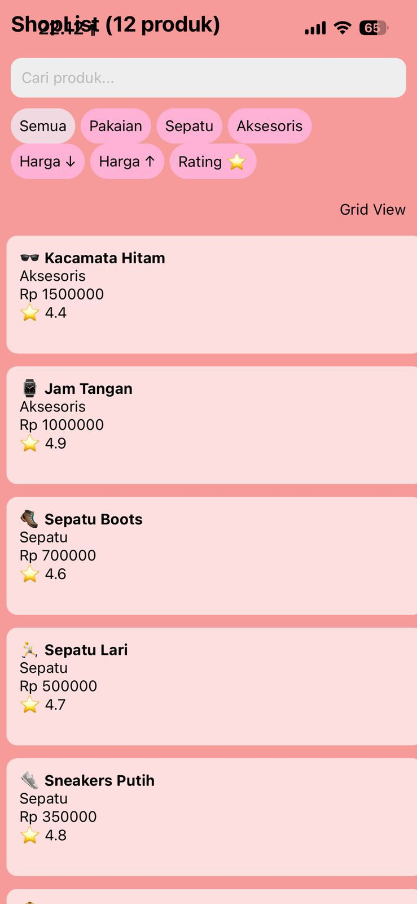
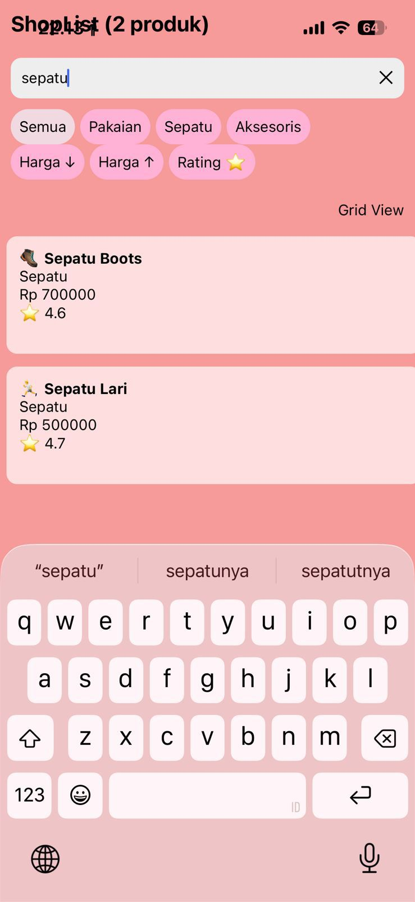
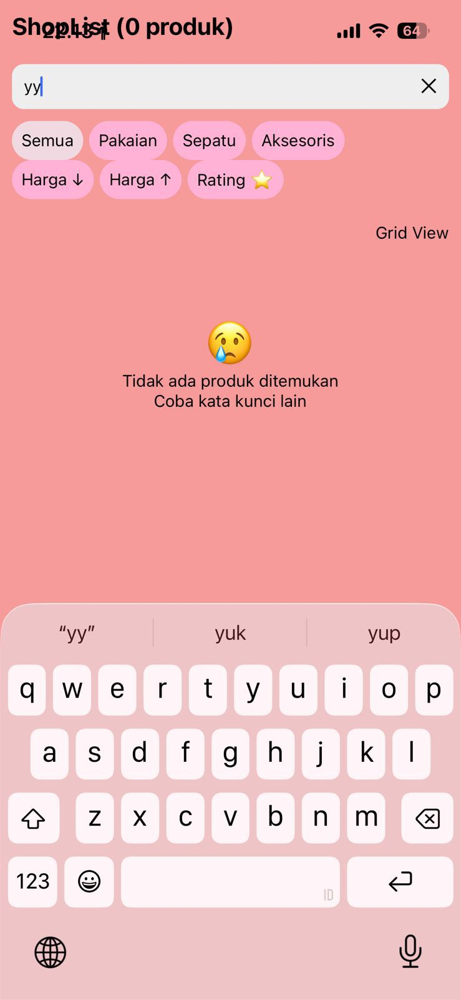

# ShopList App - Pemrograman Mobile Pertemuan 6

## Nama & NIM
- Nama: Jeviens Paradisa Finie Adena
- NIM: 243303621213

## Fitur yang Diimplementasikan
- [x] FlatList dengan 12+ produk
- [x] Custom ProductCard component (file terpisah)
- [x] keyExtractor dengan ID unik
- [x] ListEmptyComponent (empty state)
- [x] Search / Filter real-time
- [x] Pull-to-Refresh
- [x] Filter Kategori (E1)
- [x] Toggle List/Grid View (E2)
- [ ] SectionList Mode (E3)
- [ ] Sort Produk (E4)

## Screenshot

### Tampilan Utama (List Produk)

### Tampilan Search - saat ada hasil

### Tampilan Empty State - saat tidak ada hasil

## Cara Menjalankan
1. Clone repo: git clone [url-repo-kamu]  
2. Install dependencies: npm install  
3. Jalankan project: npx expo start  
4. Scan QR Code dengan Expo Go di HP